```mermaid
graph LR
    A[C++ Basics] --> B[Java Basics]
    B --> C[Control Flow]
    C --> D[Functions]
    D --> E[OOP]
    E --> F[Data Structures]
    F --> G[Algorithms]
    G --> H[Advanced Topics]
    
    style A fill:#6366F1
    style B fill:#6366F1
    style C fill:#6366F1
    style D fill:#4F46E5
    style E fill:#4338CA
    style F fill:#3730A3
    style G fill:#312E81
    style H fill:#1E1B4B
```

<div align="center">

# 💜 Welcome to My Coding Universe 💜


<br>


</div>

---

## 🌟 About Me


I am a **Computer Science student** 🎓 from **Hyderabad, Pakistan** 🇵🇰, passionate about software development and problem-solving. Currently focused on mastering **Java programming** and strengthening my **C++ foundations**, building strong skills in **algorithms**, **data structures**, and clean code practices.

### 🎯 My Journey

**C++ Code:**
```cpp
namespace ZainabAbdulQayoom {
    class Developer {
        private:
            string role = "CS Student";
            string location = "Hyderabad, Pakistan";
            string focus = "Java & C++ | DSA";
            
        public:
            void showPassion() {
                cout << "☕ Mastering Java with CodeWithHarry\n";
                cout << "🔷 Strengthening C++ Skills\n";
                cout << "📊 Building DSA foundations\n";
                cout << "🎨 Exploring Frontend Dev\n";
                cout << "🚀 Growing every day!\n";
            }
    };
}
```

**Java Code:**
```java
public class ZainabAbdulQayoom {
    private String role = "CS Student";
    private String location = "Hyderabad, Pakistan";
    private String javaMentor = "CodeWithHarry";
    
    public void showPassion() {
        System.out.println("☕ Mastering Java");
        System.out.println("📊 Building DSA foundations");
        System.out.println("🎨 Exploring Frontend");
        System.out.println("💡 Every bug is a lesson!");
    }
    
    public String getMotto() {
        return "Code is poetry written in logic! ✨";
    }
}
```

<br clear="right"/>

---

## 🎯 Current Focus

<table>
<tr>
<td width="50%" valign="top">

### 📌 What I'm Working On
- ☕ **Primary:** Java with CodeWithHarry
- 🔷 **Secondary:** C++ Programming
- 📊 **Learning:** DSA in Java
- 🎨 **Exploring:** HTML, CSS, JavaScript
- 👯 **Looking for:** Beginner Projects
- 💬 **Ask me about:** Java & C++ Basics
- ⚡ **Fun fact:** Debugging = Learning! 🐛

</td>
<td width="50%" valign="top">

### 🎯 2026 Goals
- [x] ✅ Master C++ Fundamentals
- [x] ✅ Master Java Fundamentals
- [x] ✅ Start Learning DSA
- [ ] 🔄 Build 15+ Projects
- [ ] 🔄 Contribute to Open Source
- [ ] 🔄 Solve 100+ Problems
- [ ] 🔄 Join Competitions
- [ ] 🔄 Build Portfolio

</td>
</tr>
</table>

---

## 💻 Tech Stack

<div align="center">

### 🔧 Languages


### 🛠️ Tools


### 🌱 Currently Learning


</div>

---

## 📊 GitHub Statistics

<div align="center">

<a href="https://github.com/zainabgondal">
  
  
</a>

</div>

<br>

<div align="center">


</div>

<div align="center">


</div>

---

## 🗺️ Learning Journey

<div align="center">



</div>

---

## 💭 My Philosophy

<div align="center">

### *"Code is poetry written in logic"*

**"Every line of code tells a story, every bug is a teacher, and every successful compilation is a victory."**

</div>

I believe that my journey in computer science is not just about learning syntax—it's about developing problem-solving skills, building logical thinking, and creating elegant solutions.

I embrace challenges, learn from failures, and celebrate progress. With dedication and continuous learning, I'm building the foundation to become a skilled software developer who writes clean, efficient, and meaningful code.

---

## 📫 Let's Connect!

<div align="center">

[](https://github.com/zainabgondal)
[](#)
[](mailto:gondalzainab34@gmail.com)
[](#)

<br>

**I'm open to collaborating on beginner projects • Discussing Java, C++, DSA • Learning from others • Contributing to open source**

</div>

---

## ⭐ Support My Journey

<div align="center">

**If you find my work helpful, please consider:**

⭐ Starring my repositories • 🔄 Following my profile • 💬 Giving feedback • 🤝 Collaborating

<br>

[](https://github.com/zainabgondal)
[](https://github.com/zainabgondal)

</div>

---

<div align="center">


### 💜 Crafted with Passion by Zainab Abdul Qayoom

**Committed to Excellence in Computer Science**


*Last Updated: January 2026*

</div>
