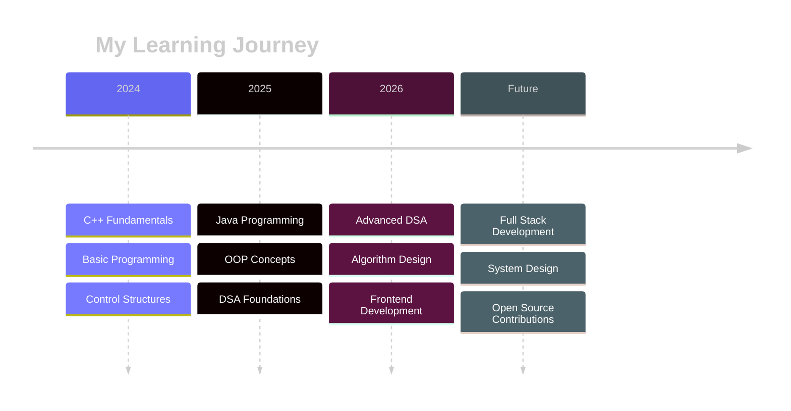

<div align="center">


<br/>

<p align="center">
  
  
  
</p>

</div>

<br/>

---


## 🌟 About Me


```yaml
name: Zainab Abdul Qayoom
located_in: Hyderabad, Pakistan
education: Computer Science Student

current_focus:
  - Java Programming with CodeWithHarry
  - C++ Programming Mastery
  - Data Structures & Algorithms
  - Frontend Development

fields_of_interest:
  - Software Development
  - Problem Solving
  - Clean Code Practices
  - Algorithm Design
  
technical_background:
  - Java (Primary)
  - C++ (Core Skill)
  - HTML, CSS, JavaScript
  - Git & GitHub
  
currently_learning:
  - DSA in Java
  - Advanced C++ Concepts
  - Web Development Basics
```

<br clear="right"/>


---

## 💻 Code Examples

<details open>
<summary><b>🔷 C++ Style</b></summary>

```cpp
#include <iostream>
#include <vector>
using namespace std;

namespace ZainabAbdulQayoom {
    class Developer {
        private:
            string role = "Computer Science Student";
            string location = "Hyderabad, Pakistan 🇵🇰";
            string primaryFocus = "Java & DSA";
            string secondaryFocus = "C++ Programming";
            
            vector<string> languages = {"Java", "C++", "C", "HTML", "CSS", "JS"};
            vector<string> tools = {"VS Code", "IntelliJ", "Git", "GitHub", "Linux"};
            
        public:
            void showPassion() {
                cout << "☕ Mastering Java with CodeWithHarry\n";
                cout << "🔷 Strengthening C++ Fundamentals\n";
                cout << "📊 Building strong DSA foundations\n";
                cout << "🎨 Exploring Frontend Development\n";
                cout << "💡 Turning bugs into breakthroughs\n";
                cout << "🚀 Growing stronger every day!\n";
            }
            
            string getMotto() {
                return "Code is poetry written in logic! ✨";
            }
    };
}

int main() {
    ZainabAbdulQayoom::Developer zainab;
    zainab.showPassion();
    cout << "\n" << zainab.getMotto() << endl;
    return 0;
}
```

</details>

<details>
<summary><b>☕ Java Style</b></summary>

```java
package dev.zainab;

public class ZainabAbdulQayoom {
    
    // Personal Info
    private String role = "Computer Science Student";
    private String location = "Hyderabad, Pakistan 🇵🇰";
    private String primaryFocus = "Java & DSA Mastery";
    
    // Learning Resources
    private String javaMentor = "CodeWithHarry";
    
    // Skills
    private String[] languages = {"Java", "C++", "C", "HTML", "CSS", "JavaScript"};
    private String[] learning = {"Data Structures", "Algorithms", "Frontend Dev"};
    private String[] tools = {"VS Code", "IntelliJ IDEA", "Git", "GitHub", "Linux"};
    
    // What Drives Me
    public void showPassion() {
        System.out.println("☕ Mastering Java with CodeWithHarry");
        System.out.println("📊 Building strong DSA foundations");
        System.out.println("🎨 Exploring Frontend Development");
        System.out.println("💡 Turning bugs into breakthroughs");
        System.out.println("🚀 Growing stronger every day!");
    }
    
    public String getMotivation() {
        return "Every line of code is a step toward mastery! 💪";
    }
    
    public String getMotto() {
        return "Code is poetry written in logic! ✨";
    }
    
    public static void main(String[] args) {
        ZainabAbdulQayoom developer = new ZainabAbdulQayoom();
        developer.showPassion();
        System.out.println("\n" + developer.getMotivation());
        System.out.println(developer.getMotto());
    }
}
```

</details>


---

## 🎯 Current Focus & Goals

<table>
<tr>
<td width="50%" valign="top">

### 📌 What I'm Working On

 **Skills I'm Learning:**

- ☕ **Primary Focus:** Java Programming (with CodeWithHarry)
- 🔷 **Secondary Focus:** C++ Programming & Mastery  
- 📊 **Core Learning:** Data Structures & Algorithms
- 🎨 **Side Quest:** Frontend Development (HTML/CSS/JS)
- 🔧 **Tools:** Git, GitHub, VS Code, IntelliJ IDEA
- 🐧 **Environment:** Linux

💬 **Ask me about:** Java, C++, DSA, Learning Journey  
⚡ **Fun fact:** Every bug teaches me something new! 🐛

</td>
<td width="50%" valign="top">

### 🎯 2026 Roadmap

```text
✅ Master C++ Fundamentals ████████████ 100%
✅ Master Java Fundamentals ████████████ 100%
✅ Start DSA Journey        ████████████ 100%
🔄 Build 15+ Projects       ████░░░░░░░░  40%
🔄 Solve 100+ Problems      ██░░░░░░░░░░  20%
🔄 Open Source Contrib      ░░░░░░░░░░░░   0%
🔄 Join Competitions        ░░░░░░░░░░░░   0%
🔄 Build Portfolio          ███░░░░░░░░░  30%
```

**Completed:** ✅ ✅ ✅  
**In Progress:** 🔄 🔄 🔄 🔄 🔄

</td>
</tr>
</table>


---

## 🛠️ Tech Stack

<div align="center">

### Languages

<p>
  
  
  
  
  
  
</p>

### Tools & Technologies

<p>
  
  
  
  
  
</p>

### Currently Learning

<p>
  
  
  
</p>

</div>


---

## 📊 GitHub Statistics

<div align="center">


<br/><br/>


</div>


---

## 🗺️ Learning Roadmap




---

## 💭 My Philosophy

<div align="center">


<br/><br/>

### 💜 *"Code is poetry written in logic"* 💜

</div>

> **"Every line of code tells a story, every bug is a teacher, and every successful compilation is a victory."**

I believe that my journey in computer science is not just about learning syntax—it's about developing **problem-solving skills**, building **logical thinking**, and creating **elegant solutions**.

**My Core Values:**
- 💪 **Persistence** - Never giving up on challenges
- 🧠 **Curiosity** - Always asking "why" and "how"
- 🎯 **Dedication** - Committed to continuous improvement
- 💡 **Creativity** - Finding innovative solutions
- 🤝 **Collaboration** - Learning and growing together


---

## 📫 Connect With Me

<div align="center">

<a href="https://github.com/zainabgondal">
  
</a>
<a href="mailto:gondalzainab34@gmail.com">
  
</a>
<a href="#">
  
</a>
<a href="#">
  
</a>

<br/><br/>

### 🌟 **I'm Always Open To:**

💼 **Collaborating** on beginner-friendly projects  
💡 **Discussing** Java, C++, DSA, and coding concepts  
🎓 **Learning** from experienced developers  
🌟 **Contributing** to open source projects  
📚 **Sharing** knowledge and resources  

</div>


---

## ⭐ Support My Journey

<div align="center">


### 💜 **If you find my work helpful, please consider:**

⭐ **Starring** my repositories  
🔄 **Following** my GitHub profile  
💬 **Providing** feedback and suggestions  
🤝 **Collaborating** on exciting projects  

<br/>

<a href="https://github.com/zainabgondal">
  
</a>
<a href="https://github.com/zainabgondal">
  
</a>

<br/><br/>

**Your support motivates me to keep learning, growing, and contributing to the developer community!** 🚀

</div>

---

<div align="center">


### 💜 Crafted with Passion by Zainab Abdul Qayoom 💜

**Committed to Excellence in Computer Science** | **Learning Java with CodeWithHarry** | **Building DSA Foundations**

<br/>


*Last Updated: January 2026*

</div>
