```mermaid
%%{init: {'theme':'base', 'themeVariables': { 'primaryColor':'#9945FF','primaryTextColor':'#fff','primaryBorderColor':'#fff','lineColor':'#9945FF','secondaryColor':'#6B46C1','tertiaryColor':'#553C9A'}}}%%
graph LR
    A[C++ Basics 📚] --> B[Control Structures 🔄]
    B --> C[Functions & Arrays 📊]
    C --> D[OOP Concepts 🎯]
    D --> E[Data Structures 🏗️]
    E --> F[Algorithms 🧮]
    F --> G[Advanced Topics 🚀]
    
    style A fill:#9945FF,stroke:#fff,stroke-width:3px,color:#fff
    style B fill:#9945FF,stroke:#fff,stroke-width:3px,color:#fff
    style C fill:#9945FF,stroke:#fff,stroke-width:3px,color:#fff
    style D fill:#6B46C1,stroke:#fff,stroke-width:2px,color:#fff
    style E fill:#553C9A,stroke:#fff,stroke-width:2px,color:#fff
    style F fill:#553C9A,stroke:#fff,stroke-width:2px,color:#fff
    style G fill:#3d2c6b,stroke:#fff,stroke-width:2px,color:#fff
```

<div align="center">

<!-- Animated Header -->


<!-- Typing Animation -->
<a href="https://git.io/typing-svg"></a>

<!-- Animated Icons -->
<p align="center">
  
  
  
</p>

<!-- Social Badges with Animation -->
<p align="center">
  <a href="https://www.linkedin.com/in/ZainabGondal">
    
  </a>
  <a href="https://github.com/zainabgondal">
    
  </a>
  
</p>

<!-- Animated Divider -->


</div>

##  About Me


```cpp
class ZainabAbdulQayoom {
private:
    string role = "CS Student";
    string currentFocus = "C++ Programming";
    string learning = "Problem Solving & DSA";
    string location = "Karachi, Pakistan 🇵🇰";
    
public:
    void showPassion() {
        cout << "🔭 Mastering C++ fundamentals\n";
        cout << "🌱 Building strong logic\n";
        cout << "💪 Growing with every error!\n";
    }
    
    vector<string> getInterests() {
        return {"C++", "Algorithms", 
                "Problem Solving", "Open Source"};
    }
    
    string getMotivation() {
        return "Turning bugs into features! 🐛➡️✨";
    }
};
```

<br clear="right"/>

<!-- Animated Divider -->


##  Current Focus

<table width="100%">
<tr>
<td width="50%" valign="top">

### 🎯 Learning Goals
- 🔭 **Working On:** C++ Fundamentals & Core Concepts
- 🌱 **Learning:** Data Structures & Algorithms
- 👯 **Collaborate:** Beginner-friendly C++ Projects
- 🤝 **Need Help:** Clean & Efficient Code Practices
- 💬 **Ask Me About:** C++ Basics & Programming Journey
- ⚡ **Fun Fact:** Every error = Stronger logic! 💪

</td>
<td width="50%" valign="top">

### 🏆 2026 Goals
- [x] ✅ Master C++ Fundamentals
- [ ] 🔄 Build 10+ Practice Projects
- [ ] 🔄 Contribute to Open Source
- [ ] 🔄 Learn DSA Comprehensively
- [ ] 🔄 Join Coding Competitions
- [ ] 🔄 Strong GitHub Portfolio

</td>
</tr>
</table>

<!-- Animated Divider -->


##  Tech Stack

<div align="center">

### 💻 Languages
<p>
  
  
</p>

### 🛠️ Tools & Platforms
<p>
  
  
  
  
</p>

### 🎨 Design Elements
<p>
  
</p>

</div>

<!-- Animated Divider -->


##  GitHub Analytics

<div align="center">
  
<!-- Stats Cards -->


<!-- Language Stats -->


<!-- Activity Graph -->


<!-- Trophy -->


</div>

<!-- Animated Divider -->


##  Learning Journey



<!-- Animated Divider -->


##  Coding Philosophy

<div align="center">


</div>

<!-- Animated Divider -->


##  Let's Connect

<div align="center">

<!-- Social Links -->
<a href="https://www.linkedin.com/in/ZainabGondal">
  
</a>
<a href="https://github.com/zainabgondal">
  
</a>
<a href="mailto:your.email@example.com">
  
</a>

<br><br>

<!-- Animated GIF -->


### ⭐ Show Some Love!
**If you find my projects interesting, drop a ⭐ on my repos!**


</div>

<!-- Snake Animation -->
<div align="center">
  
</div>

<!-- Animated Footer -->


<div align="center">
  
### 💜 Made with passion by Zainab Abdul Qayoom

**Happy Coding!** 💻✨

*Last Updated: January 2026*

</div>
