```mermaid
%%{init: {'theme':'base', 'themeVariables': { 'primaryColor':'#6366F1','primaryTextColor':'#fff','primaryBorderColor':'#C9D1D9','lineColor':'#6366F1','secondaryColor':'#4F46E5','tertiaryColor':'#4338CA'}}}%%
graph LR
    A[🎯 C++ Basics] --> B[🔄 Control Flow]
    B --> C[📦 Functions]
    C --> D[🏗️ OOP]
    D --> E[📊 Data Structures]
    E --> F[🧮 Algorithms]
    F --> G[⚡ Advanced C++]
    
    style A fill:#6366F1,stroke:#C9D1D9,stroke-width:3px,color:#fff
    style B fill:#6366F1,stroke:#C9D1D9,stroke-width:3px,color:#fff
    style C fill:#6366F1,stroke:#C9D1D9,stroke-width:3px,color:#fff
    style D fill:#4F46E5,stroke:#C9D1D9,stroke-width:2px,color:#fff
    style E fill:#4338CA,stroke:#C9D1D9,stroke-width:2px,color:#fff
    style F fill:#3730A3,stroke:#C9D1D9,stroke-width:2px,color:#fff
    style G fill:#312E81,stroke:#C9D1D9,stroke-width:2px,color:#fff
```

<div align="center">

<!-- Animated Header Wave -->


<!-- Dynamic Typing Effect -->
<a href="https://git.io/typing-svg">
  
</a>

<br><br>

<!-- Social Badges -->
<p align="center">
  <a href="https://www.linkedin.com/in/ZainabGondal" target="_blank">
    
  </a>
  <a href="https://github.com/zainabgondal" target="_blank">
    
  </a>
  <a href="mailto:zz472125@gmail.com">
    
  </a>
  <br><br>
  
  
  
</p>

<!-- Elegant Divider -->


</div>

<br>

##  About Me


<div align="left">

I am a **Computer Science student** passionate about software development and problem-solving. Currently focused on mastering **C++ programming**, building strong foundations in algorithms, data structures, and clean code practices.

### 🎯 Professional Profile

```cpp
namespace ZainabAbdulQayoom {
    class Developer {
    private:
        string role = "Computer Science Student";
        string focus = "C++ Programming & DSA";
        string location = "Karachi, Pakistan 🇵🇰";
        
    public:
        void showPassion() {
            cout << "🔭 Mastering C++ fundamentals\n";
            cout << "🌱 Learning DSA & Algorithms\n";
            cout << "💪 Building strong logic\n";
            cout << "🚀 Growing every day!\n";
        }
        
        vector<string> getSkills() {
            return {"C++", "Problem Solving", 
                    "Algorithms", "Git/GitHub"};
        }
        
        string getMotto() {
            return "Every error is a lesson! 💡";
        }
    };
}
```

</div>

<br clear="right"/>


<br>

##  Current Focus

<table width="100%">
<tr>
<td width="50%" valign="top">

### 📌 What I'm Working On

- 🔭 **Focus:** C++ Fundamentals & Core Concepts
- 🌱 **Learning:** Data Structures & Algorithms
- 👯 **Collaborate:** Beginner-friendly C++ Projects
- 🤝 **Need Help:** Clean & Efficient Coding
- 💬 **Ask Me About:** C++ Basics & Learning Journey
- ⚡ **Fun Fact:** Debugging = Learning! 🐛

</td>
<td width="50%" valign="top">

### 🎯 2026 Goals

- [x] ✅ Master C++ Fundamentals
- [ ] 🔄 Build 10+ Practice Projects
- [ ] 🔄 Contribute to Open Source
- [ ] 🔄 Learn DSA Comprehensively
- [ ] 🔄 Join Coding Competitions
- [ ] 🔄 Build Strong Portfolio

</td>
</tr>
</table>

<br>


<br>

##  Tech Stack

<div align="center">

### Programming Languages

<table>
<tr>
<td align="center" width="120">

<br><strong>C++</strong>
</td>
<td align="center" width="120">

<br><strong>C</strong>
</td>
</tr>
</table>

### Development Tools

<table>
<tr>
<td align="center" width="110">

<br><strong>GitHub</strong>
</td>
<td align="center" width="110">

<br><strong>VS Code</strong>
</td>
<td align="center" width="110">

<br><strong>Git</strong>
</td>
<td align="center" width="110">

<br><strong>Linux</strong>
</td>
</tr>
</table>

<br>


</div>

<br>


<br>

##  GitHub Statistics

<div align="center">

### 📊 Profile Overview

<p align="center">


</p>

<br><br>

### 📈 Contribution Activity


<br><br>

### 📌 Repository Insights

<table align="center">
<tr>
<td align="center" width="150">

</td>
<td align="center" width="150">

</td>
<td align="center" width="150">

</td>
</tr>
</table>

</div>

<br>


<br>

##  Learning Journey

<div align="center">



</div>

<br>


<br>

##  My Philosophy

<div align="center">

<table width="100%">
<tr>
<td align="center">

### *"Code is poetry written in logic"*

**I believe that every line of code tells a story, every bug is a teacher, and every successful compilation is a victory. My journey in computer science is not just about learning syntax—it's about developing problem-solving skills, building logical thinking, and creating elegant solutions.**

**I embrace challenges, learn from failures, and celebrate progress. With dedication and continuous learning, I'm building the foundation to become a skilled software developer who writes clean, efficient, and meaningful code.**

</td>
</tr>
</table>

<br>


</div>

<br>


<br>

##  Let's Connect

<div align="center">

### **Get In Touch**

<a href="https://www.linkedin.com/in/ZainabGondal" target="_blank">
  
</a>
<a href="https://github.com/zainabgondal" target="_blank">
  
</a>
<a href="mailto:zz472125@gmail.com">
  
</a>

<br><br>

### ⭐ Support My Journey

**If you find my projects helpful or interesting, please consider giving them a star!**  
**Your support motivates me to keep learning and growing.**

<br>


<br><br>

### 🐍 Contribution Snake

<picture>
  <source media="(prefers-color-scheme: dark)" srcset="https://raw.githubusercontent.com/zainabgondal/zainabgondal/output/github-contribution-grid-snake-dark.svg">
  <source media="(prefers-color-scheme: light)" srcset="https://raw.githubusercontent.com/zainabgondal/zainabgondal/output/github-contribution-grid-snake.svg">
  
</picture>

</div>

<br>

<!-- Footer Wave -->


<div align="center">

---

<br>

### 💜 Crafted with Passion by Zainab Abdul Qayoom

**Committed to Excellence in Computer Science**

<br>


<br>

*Last Updated: January 2026*

</div>
