```mermaid
%%{init: {'theme':'base', 'themeVariables': { 'primaryColor':'#6366F1','primaryTextColor':'#fff','primaryBorderColor':'#C9D1D9','lineColor':'#6366F1','secondaryColor':'#4F46E5','tertiaryColor':'#4338CA','fontSize':'16px'}}}%%
graph LR
    A[🎯 C++ Basics] --> B[🔄 Control Flow]
    B --> C[📦 Functions & Arrays]
    C --> D[🏗️ OOP Principles]
    D --> E[📊 Data Structures]
    E --> F[🧮 Algorithms]
    F --> G[⚡ Advanced C++]
    G --> H[🚀 System Design]
    
    style A fill:#6366F1,stroke:#C9D1D9,stroke-width:3px,color:#fff
    style B fill:#6366F1,stroke:#C9D1D9,stroke-width:3px,color:#fff
    style C fill:#6366F1,stroke:#C9D1D9,stroke-width:3px,color:#fff
    style D fill:#4F46E5,stroke:#C9D1D9,stroke-width:2px,color:#fff
    style E fill:#4338CA,stroke:#C9D1D9,stroke-width:2px,color:#fff
    style F fill:#3730A3,stroke:#C9D1D9,stroke-width:2px,color:#fff
    style G fill:#312E81,stroke:#C9D1D9,stroke-width:2px,color:#fff
    style H fill:#1E1B4B,stroke:#C9D1D9,stroke-width:2px,color:#fff
```

<div align="center">

<!-- Animated Header with Wave -->


<!-- Dynamic Typing Animation -->
<a href="https://git.io/typing-svg">
  
</a>

<br>

<!-- Professional Badges -->
<p align="center">
  <a href="https://www.linkedin.com/in/ZainabGondal" target="_blank">
    
  </a>
  <a href="https://github.com/zainabgondal" target="_blank">
    
  </a>
  <a href="mailto:your.email@example.com">
    
  </a>
  
</p>

<!-- Elegant Divider -->


</div>

<br>

##  **Professional Summary**


<div align="left">

I am a dedicated **Computer Science student** with a strong passion for software development and problem-solving. Currently focused on mastering **C++ programming**, I am building a solid foundation in core computer science principles and modern development practices.

### 🎯 **Core Competencies**

```cpp
namespace ZainabAbdulQayoom {
    class ProfessionalProfile {
    private:
        std::string currentRole = "Computer Science Student";
        std::string specialization = "C++ Development";
        std::string location = "Karachi, Pakistan";
        std::vector<std::string> focus = {
            "Data Structures & Algorithms",
            "Object-Oriented Programming",
            "Problem Solving & Logic Building",
            "Clean Code Practices"
        };
        
    public:
        void displayMission() {
            std::cout << "🎯 Building robust software solutions\n";
            std::cout << "📚 Continuous learning and improvement\n";
            std::cout << "🤝 Contributing to open-source community\n";
            std::cout << "💡 Transforming ideas into code\n";
        }
        
        std::string getVision() {
            return "Aspiring to become a proficient software engineer "
                   "who writes elegant, efficient, and maintainable code.";
        }
    };
}
```

</div>

<br clear="right"/>

<!-- Professional Divider -->


<br>

##  **Current Focus & Objectives**

<table width="100%" border="0">
<tr>
<td width="50%" valign="top">

### 📌 **What I'm Working On**

- **🔭 Primary Focus:** Mastering C++ fundamentals and advanced concepts
- **🌱 Currently Learning:** Data Structures, Algorithms, and Design Patterns
- **👯 Open to Collaborate:** Educational C++ projects and coding challenges
- **🤝 Seeking Guidance:** Best practices in software architecture and optimization
- **💬 Happy to Discuss:** C++ development, problem-solving strategies, learning resources
- **⚡ Philosophy:** *"Quality over quantity, learning over knowing"*

</td>
<td width="50%" valign="top">

### 🎯 **Professional Goals (2026)**

- ✅ **Achieved:** Solid grasp of C++ fundamentals
- 🔄 **In Progress:** Complete 10+ substantial C++ projects
- 🔄 **Planned:** Active contributions to open-source repositories
- 🔄 **Target:** Master data structures and algorithm implementation
- 🔄 **Aspiration:** Participate in competitive programming contests
- 🔄 **Vision:** Build a comprehensive portfolio of quality work

</td>
</tr>
</table>

<br>

<!-- Professional Divider -->


<br>

##  **Technical Proficiencies**

<div align="center">

### **Programming Languages**

<table>
<tr>
<td align="center" width="100">

<br><strong>C++</strong>
</td>
<td align="center" width="100">

<br><strong>C</strong>
</td>
</tr>
</table>

### **Development Tools & Environment**

<table>
<tr>
<td align="center" width="110">

<br><strong>VS Code</strong>
</td>
<td align="center" width="110">

<br><strong>Git</strong>
</td>
<td align="center" width="110">

<br><strong>GitHub</strong>
</td>
<td align="center" width="110">

<br><strong>Linux</strong>
</td>
</tr>
</table>

### **Technology Badges**


</div>

<br>

<!-- Professional Divider -->


<br>

##  **GitHub Performance Metrics**

<div align="center">

### **Profile Statistics**

<p align="center">
  
  
</p>

<br>

### **Repository Insights**

<table align="center">
<tr>
<td align="center">

</td>
<td align="center">

</td>
</tr>
<tr>
<td align="center">

</td>
<td align="center">

</td>
</tr>
</table>

<br>

### **Contribution Activity**

<p align="center">
  
</p>

</div>

<br>

<!-- Professional Divider -->


<br>

##  **Learning & Development Roadmap**

<div align="center">



</div>

<br>

<!-- Professional Divider -->


<br>

##  **Professional Philosophy**

<div align="center">

<table>
<tr>
<td align="center" width="100%">

### *"Excellence is not a destination, but a continuous journey"*

**My approach to software development is rooted in continuous learning, disciplined practice, and a commitment to writing code that is not only functional but elegant and maintainable. Every challenge is an opportunity to grow, every error is a lesson in disguise, and every successful compilation is a step toward mastery.**

**I believe in the power of clean code, the importance of good documentation, and the value of collaboration. As I build my skills in C++, I'm not just learning syntax—I'm developing the mindset of a professional software engineer.**

</td>
</tr>
</table>

<br>


</div>

<br>

<!-- Professional Divider -->


<br>

##  **Professional Network**

<div align="center">

### **Let's Connect and Collaborate**

<br>

<a href="https://www.linkedin.com/in/ZainabGondal" target="_blank">
  
</a>
<a href="https://github.com/zainabgondal" target="_blank">
  
</a>
<a href="mailto:your.email@example.com">
  
</a>

<br><br>

### **Support My Work**

<p>
If you find my projects valuable or my code helpful, please consider giving them a ⭐<br>
Your support motivates me to continue learning and contributing to the community!
</p>

<br>


</div>

<br>

<!-- Snake Contribution Animation -->
<div align="center">
  
</div>

<br>

<!-- Professional Footer with Wave -->


<div align="center">

---

<br>

### 💼 **Professional Portfolio by Zainab Abdul Qayoom**

**Committed to Excellence in Computer Science & Software Development**

<br>


<br>

*Last Updated: January 2026 • Crafted with 💜 and dedication*

</div>
